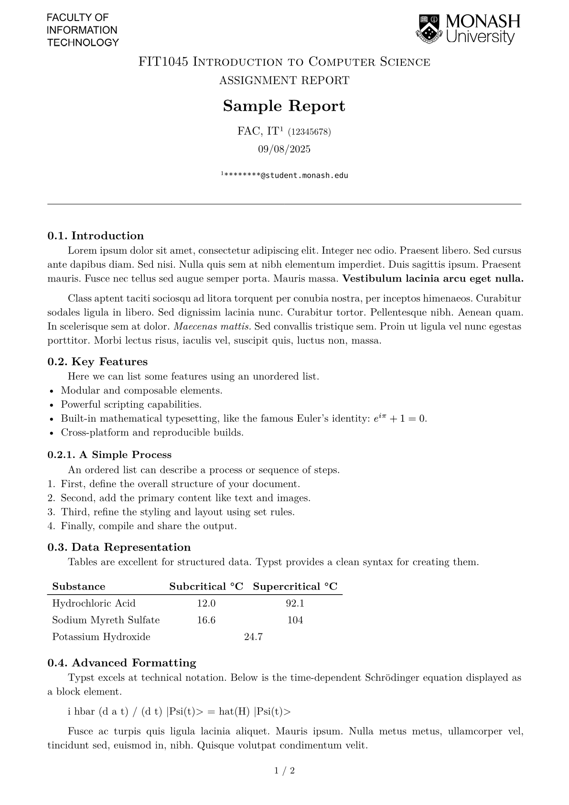
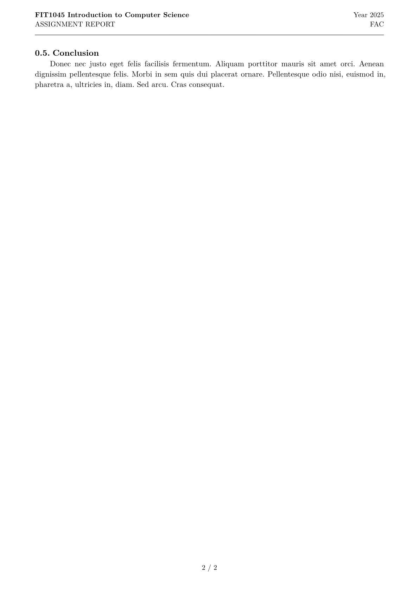

# monash-report


A report template for Monash students, specially for FIT. Not affiliated with the university.

<p align="center">
  
&nbsp; &nbsp; &nbsp; &nbsp;
  
</p>

## Usage

1. **Clone this repository:**
```bash
git clone https://github.com/yunfenglong/monash-report.git
cd monash-report
```

2. **Create your Typst document:**
```typst
#import "src/lib.typ": report

#show: report.with(
  // Your report parameters here
)
```

3. **Compile your document:**
```bash
# Generate PDF
typst compile --root . template/main.typ

# Watch for changes (optional) -> hot reload
typst watch --root . template/main.typ
```

- `institution`: the institution logo for the report.
  - `"unlp"`: National University of La Plata (default)
  - If you want to use a different logo, just write the logo path
- `academic-unit`: the academic unit logo for the report.
  - If you want to use a different logo, just write the logo path
  - If the Monash academic unit is not in the list, [create an issue](https://github.com/yunfenglong/monash-report/issues/new) with the logo link and we'll add it to the template.
- `subject`: the subject name (`str`).
- `title` (`content`, optional): the more formal title of the report, like `[ASSIGNMENT REPORT]`.
- `team` (`content`): the team name, like `[Group Monash]`.
- `authors` (`array`): the project authors. Each author has
  - `name` (`str`): the author's name in the format `Surname, Name`; 
  - `email` (`str`, optional): an email;
  - `student-id` (`str`, optional): a student ID;
  - `notes` (`array` or `str`, optional): other notes, like `"Report responsible author"`.
- `descriptive-title` (`str`): the project title itself, like `"Sample Report"`.
- `summary` (`content`, optional): a summary of what the report is about or the project objective. It's a free field to write with the desired format.
- `date` (`date` or `str`): the report submission date, can be written as `"2023-10-01"` (October 1, 2023).
- `format` (`dict`, optional): other report settings:
  - `typography` (`str`, optional): the report typography, _New Computer Modern_ by default;
  - `margins` (optional): can be
    - `"symmetric"`: same margins on each side (default),
    - `"bound"`: wider margins where the binding would go.


### Appendices

To add appendices to the report, you can use the `appendix` command where the appendices begin. For example:

```typst
#import "../src/lib.typ": report, appendix

#show: report.with(
  // report parameters
)

// ... report content

#show: appendix

= Data Tables // Appendix A
// ...

= Other Information // Appendix B
// ...
```

### Symbols Table

To add a symbols/nomenclature table to the report, you can use the `nomenclature` command where the table begins. For example:

```typst
#import "../src/lib.typ": report, nomenclature

#show: report.with(
  // report parameters
)

#nomenclature(
  ($S_1$, [Symbol 1]),
  ($S_2$, [Symbol 2]),
  ($S_3$, [Symbol 3]),
)
```

## Development

To generate the `main.pdf` document and the cover image `thumbnails/1.png`, you need to change

```bash
# Generate PDF
typst compile --root . --pdf-standard a-2b template/main.typ
# Generate thumbnail.png
typst compile --root . --format png template/main.typ "thumbnails/{p}.png"
oxipng -o 2 --strip safe thumbnails/*.png
```